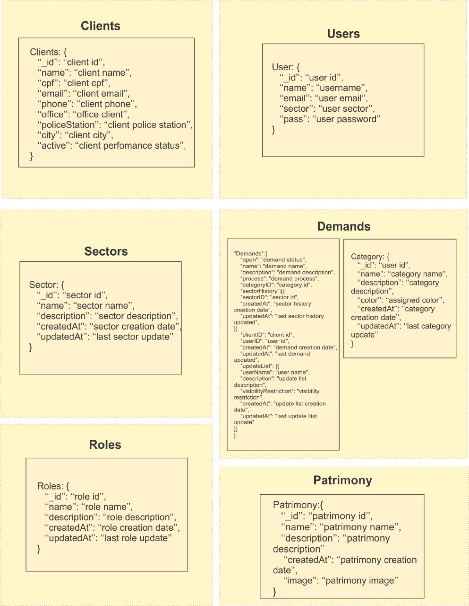
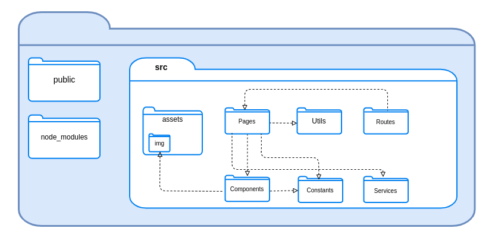

<h1 style='text-align: center;'>Documento de Arquitetura</h1>

## Introdução

### Finalidade

&emsp;&emsp;Esse documento de arquitetura tem como finalidade esclarecer e especificar decisões arquiteturais pertinentes durante o desenvolvimento do projeto, oferecendo uma visão geral das tecnologias e funcionalidades utilizadas.

### Escopo

&emsp;&emsp;O SiGeD (Sistema de Gerenciamento de Demandas) consiste em uma aplicação web que visa facilitar a gerência dos processos da Divisão de Proteção à Saúde do Servidor (DPSS).

&emsp;&emsp;Nesse documento de arquitetura, é feita uma descrição dos termos arquiteturais utilizados no desenvolvimento desse produto de software.

<h2>Representação da Arquitetura</h2>

### Diagrama de relações

&emsp;&emsp;O diagrama representa a divisão da aplicação em microsserviços de usuário, clientes, demandas, setores, cargos e patrimônio.

### Diagrama React/Microsserviços

#### **REACT**

&emsp;&emsp;A aplicação web utiliza no front-end o framework React. A divisão é feita em <i>Pages</i>, <i>Services</i>, <i>Components</i> e <i>Constants</i>.

* Pages: armazena as telas do website.

* Services: local onde são realizadas as comunicações com a API.

* Components: reúne os componentes utilizados nas telas da aplicação, como botões e a navbar.

* Constants: armazena os códigos das cores utilizadas. 

#### **MICROSSERVIÇOS**

&emsp;&emsp;Os microsserviços foram construídos utilizando Nodejs e o framework Express.js, onde cada microsserviço tem um banco de dados independente. Para o controle e armazenamento dos dados, foi empregado o banco de dados não relacional MongoDB.

&emsp;&emsp;Dada a alta escalabilidade dos microsserviços, foram definidos cinco para essa aplicação, sendo eles o de usuários, responsável pela autenticação, o de demandas, clientes, setores e cargos. O padrão JWT foi utilizado para fazer essa autenticação, portanto, um token é gerado no microsserviço de usuários e salvo na aplicação. Uma vez que haja um token válido, é possível fazer requisições em todos os microsserviços utilizando-o.

### **Diagrama Context API**

&emsp;&emsp;A Context API é um recurso nativo do React que envolve toda a aplicação e, pode ser utilizado para fornecer estados globais para todos os elementos que necessitem dessa informação dentro da aplicação.

&emsp;&emsp;Esse recurso foi utilizado na aplicação principalmente para armazenar e utilizar os dados do usuário logado. Abaixo, é possível ver uma representação de como funciona e em qual parte do projeto esse recurso é utilizado.

## Metas e Restrições de Arquitetura
Metas:

- Estabilidade do sistema;
- Clareza na apresentação das funcionalidades;
- Fácil manutenção;

Restrições: 

- **React:** framework javascript utilizado para a criação da interface do usuário;
- **Node.js:** desenvolvimento dos microsserviços;
- **MongoDB**: banco de dados não relacional;

## Visão de Implementação

### Modelagem de dados

### Diagrama de pacotes

#### **Frontend**

#### **Backend**

## Referências

Equipe de GCES do SiGed 2020-2 - Documento de arquitetura Disponível em: https://fga-eps-mds.github.io/2020-2-SiGeD/architecturedocument/. Acesso em: 15 mar. 2022.

## Histórico

| Versão | Data       | Modificação                    | Autor(es) |
| ------ | ---------- | ------------------------------ | ----- |
| 0.1    | 14/03/2022 | Criação do documento  | Murilo |
| 0.2    | 15/03/2022 | Adição do serviço de cargos | Murilo |
| 1.0    | 15/03/2022 | Finalização da primeira versão e revisão | Murilo |
| 2.0    | 18/03/2022 | Adição das referencias | Rafael |
| 3.0    | 11/01/2023 | Atualização de diagrama de dados e de relações | Eduarda e Mateus |